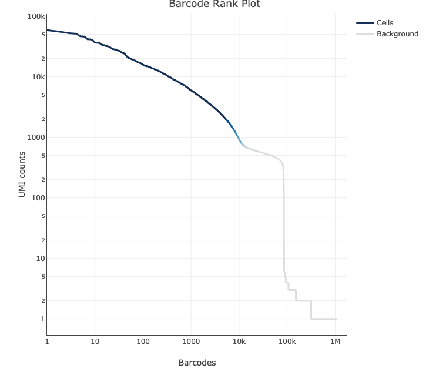

# How to read 10X Cellranger "Ranked Barcode Plot"
Below is showing a **Ranked Barcode Plot**, obtained from running 10X Genomics Cellranger's `cellranger count` function. 

- **y-axis**: number of UMI counts mapped to each barcode.

- **x-axis**: number of barcodes below "that" UMI counts. 

- The steep drop-off in plot seperates cell-associated barcodes (on the left of x-axis) and empty partitions (on the right of x-axis). 

- Barcodes can be determined to be cell-associated based on their UMI count or by their RNA-profile. In other words, if there is enough UMI counts or RNAs associated with the barcode, this barcode is cell-associated. 
