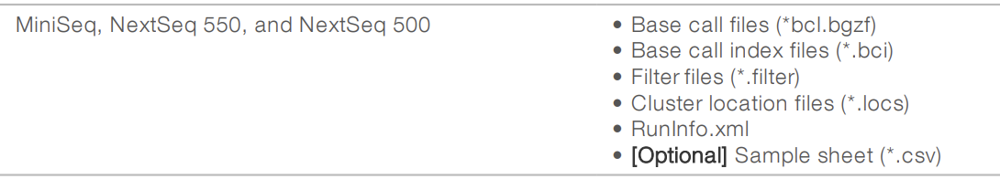

# Convert bcl to fastq

snRNA-seq data is saved in bcl format, to convert it into fastq file format, two packages are required: cellranger and bcl2fastq2. 

The conversion command is `cellranger mkfastq`. The FASTQ output generated will be the same as when running bcl2fastq directly. Cited from here: [cellranger mkfastq and bcl2fastq2](https://janis.readthedocs.io/en/latest/tools/bioinformatics/cellranger/cellrangermkfastq.html)

***
**Questions before I start:**

- How are Undetermined fastq files determined?
***


## How does bcl2fastq2 work?
Reference: [bcl2fastq mannual](https://sapac.support.illumina.com/content/dam/illumina-support/documents/documentation/software_documentation/bcl2fastq/bcl2fastq2-v2-20-software-guide-15051736-03.pdf)

**BCL to FASTQ Conversion Process**

The software uses input files, which are the output of a sequencing run, to convert BCL files into FASTQ files. For each cluster that passes filter (PF), the software writes one entry to one FASTQ file for each sample in each read.
- For a single-read run, the software creates one Read 1 FASTQ file per sample.
- For a paired-end run, the software creates one Read 1 and one Read 2 FASTQ file per sample.
The sample FASTQ files are compressed and appended with the *fastq.gz extension. Thus, per-cycle BCL files are converted into per-read FASTQ files that can be used as input for data analysis.


**Demultiplexing Process**

Multiplexing adds a unique index adapter sequence to each sample during library prep, generating uniquely tagged libraries that can be identified and sorted for analysis. Demultiplexing then assigns clusters to a sample based on the index adapter sequence of the cluster.
- To optimize demultiplexing results, choose index adapters that optimize color balance when performing library prep. For more information, see the Index Adapters Pooling Guide.
- The bcl2fastq2 Conversion Software demultiplexes multiplexed samples as part of the conversion process. If samples are not multiplexed, the software skips demultiplexing and assigns all clusters in a flow cell lane to one sample.


**Adapter Trimming and UMI Removal**

Depending on settings, the bcl2fastq2 Conversion Software trims adapter sequences and removes Unique Molecular Identifier (UMI) bases from reads:
- Adapter trimming—The software determines whether a read extends past the DNA insert and into the sequencing adapter. An approximate string matching algorithm identifies all or part of the adapter sequence and treats inserts and deletions (indels) as one mismatch. **Base calls matching the adapter sequence and beyond are masked or removed from the FASTQ file.**
- UMI removal—UMIs are random k-mers attached to the genomic DNA (gDNA) before polymerase chain reaction (PCR) amplification. After the UMI is amplified with amplicons, the software can retrieve the bases and include them in the read name in the FASTQ files. When the TrimUMI sample sheet setting is active, the software can also remove the bases from the reads.

***
**To think:**

- How does the fastq file look like after bcl conversion?
[sequence construct](http://nextgen.mgh.harvard.edu/CustomPrimer.html)
***

## Commands on ERISOne:
**Input file:** after downloading bcl files from Illumina Basespace, a series of files will be included in the downloaded file. One of them is **SampleSheet.csv**. Other files included are (based on different sequencing platforms, various file formats will be included, check on [bcl2fastq mannual](https://sapac.support.illumina.com/content/dam/illumina-support/documents/documentation/software_documentation/bcl2fastq/bcl2fastq2-v2-20-software-guide-15051736-03.pdf)):

**Output of NextSeq 550:**



**Sample Sheets:**
A sample sheet (SampleSheet.csv) records information about samples and the corresponding index adapters. The bcl2fastq2 Conversion Software uses this information to demultiplex and convert BCL files. For most runs, a sample sheet is optional. The default location is the root output folder, but you can use the command `--sample-sheet` (bcl2fastq2, use `--csv=` to specify if using cellranger mkfastq) to specify any CSV file in any location. When a sample sheet is not provided, the software assigns all reads to the default sample Undertermined_S0.

**DemultiplexingScenarios**

For each sample listed in a sample sheet, the software produces one FASTQ file for each sample for each read.
- When a sample sheet contains multiplexed samples, the software:
- **Places reads without a matching index adapter sequence in the Undetermined_S0 FASTQ file.**
- Places reads with valid index adapter sequences in the sample FASTQ file.
- When a sample sheet contains one unindexed sample, all reads are placed in the sample FASTQ files (one each for Read 1 and Read 2).
- When a sample sheet does not exist, or exists but has no Data section, all reads are placed in one FASTQ file named Undetermined_S0.
- When the Lane column in the Data section is not used, all lanes are converted. Otherwise, only populated lanes are converted.

--adapter-stringency: The default value of 0.9 indicates that only reads with > 90% sequence identity with the adapter are trimmed.

**FASTQ FilesDirectory**

The software writes compressed, demultiplexed FASTQ files to the directory <run folder>\Data\Intensities\BaseCalls.
- If a sample sheet specifies the Sample_Project column for a sample, the software places the FASTQ files for that sample in the directory <run folder>\Data\Intensities\BaseCalls\<Project>. The same project directory contains the files for multiple samples.
- If the Sample_ID and Sample_Name columns are specified but do not match, the FASTQ files reside in a <SampleID> subdirectory where files use the Sample_Name value.
**Reads with unidentified index adapters are recorded in one file named Undetermined_S0_.** If a sample sheet includes multiple samples without specified index adapters, the software displays a missing barcode error and ends the analysis.
  
**Behavioral Options** check on page 13 [bcl2fastq mannual](https://sapac.support.illumina.com/content/dam/illumina-support/documents/documentation/software_documentation/bcl2fastq/bcl2fastq2-v2-20-software-guide-15051736-03.pdf)

For example, The default value of 0.9 (--adapter-stringency) indicates that only reads with > 90% sequence identity with the adapter are trimmed.

***
**Summary**

- cellranger mkfastq or bcl2fastq converts bcl file into FASTQ file. 
- after conversion, FASTQ files will be splitted/assigned into two parts: sample FASTQ and undetermined FASTQ.
- samples are assigned based on the Index Adapter sequence. 
- Places reads without a matching index adapter sequence in the Undetermined FASTQ file.
- for any FASTQ file in the input, reads with > 90% sequence identity with the Adapter are trimmed. Sequenced Adapter sequences are modified to expected Adapter sequences.
***

**Codes:**
```
module load cellranger/3.0.2
module load bcl2fastq2/2.19.1
module load bcl2fastq2/2.20.0

cellranger mkfastq --qc --id=Justin_TZ_mkfastq \
                   --run=/data/bioinformatics/projects/sahar2021/Tingting/2_data_Justin_cellranger_scriptTest \
                   --csv=/data/bioinformatics/projects/sahar2021/Tingting/2_data_Justin_cellranger_scriptTest/SampleSheet_modified.csv
```
