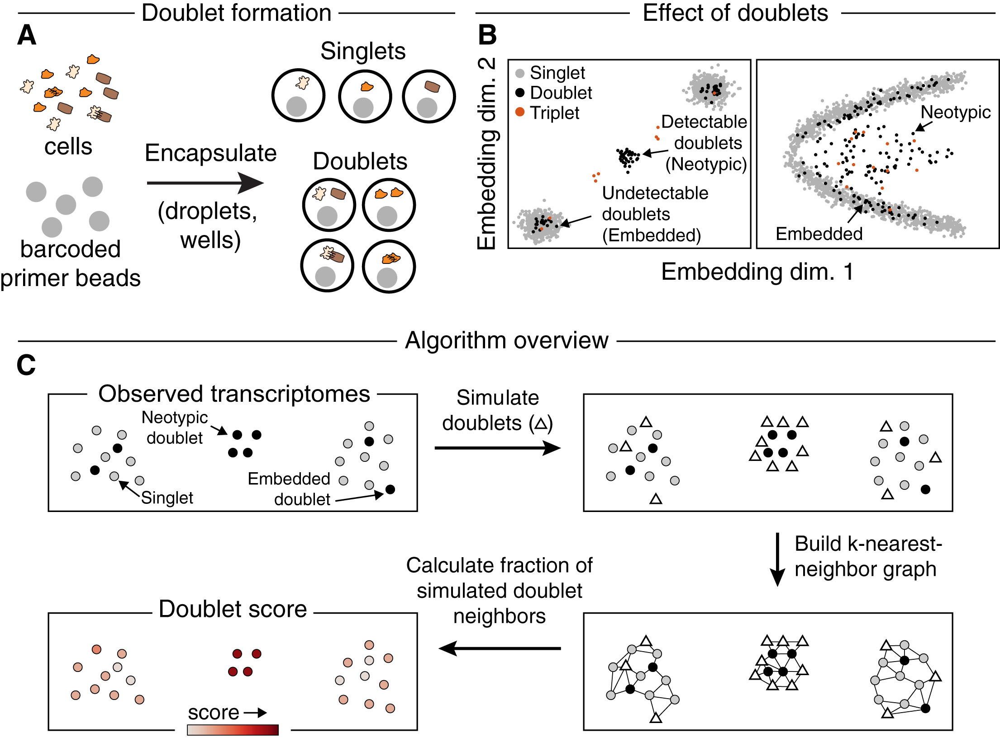

# Srublet for scRNA-seq doublet removing

Here is Srublet Github page: [Srublet Github](https://github.com/swolock/scrublet)

Srublet analysis example can be found: [Srublet Example](https://github.com/swolock/scrublet/blob/master/examples/scrublet_basics.ipynb)

Srublet analysis discussion can be found: [Srublet Discussion](https://github.com/swolock/scrublet/issues/3)

To identify doublets from scRNA-seq data set, I followed the python pipeline posted on Srublet Github and did a few modifications. 

- Filtered matrix from cellranger output was used as Srublet input.
- Run python scripts from termnial.
- Srublet output includes: on-screen printing results as mentioned in Srublet paper, two figures and two tables (one for doublet score, one binary file telling if a cell is doublet or not).

## Srublet paper overview and the algorithm:
<p align="center">
  
</p>

**Notes**
- Srublet paper defined two types of doublets: neotypic doublets and embedded doublets.
- Neotypic doublets are hypothesized to have two cells with distinct transcriptomes captured in one gem. Neotypic doublets are distinguishable from singlets. Figure A B.
- Embedded doublets are hypothesized to have two similar cells with similar transcriptomes captured in one gem. Embedded doublets are indistinguishable from singlets. Figure A B.
- Observed transcriptomes are cells in a data set, which containing singlets, embedded doublets and neotypic doublets. 
- Algorithm: doublets are simulated by randomly sampling and combining observed transcriptomes, and the local density of simulated doublets, as measured by a nearest neighbor graph, is used to calculate a doublet score for each observed transcriptome. 
- Srublet involves two steps. First, doublets (multiplets of just two cells) are simulated from the data by combining random pairs of observed transcriptomes. Second, each observed transcriptome is scored based on the relative densities of simulated doublets and observed transcriptomes in its vicinity. 


## Codes:
```
python
import scrublet as scr
import scipy.io
import matplotlib.pyplot as plt
import numpy as np
import os

plt.rcParams['font.family'] = 'sans-serif'
plt.rcParams['font.sans-serif'] = 'Arial'
plt.rc('font', size=14)
plt.rcParams['pdf.fonttype'] = 42

# used callranger output filtered matrix and features as input
input_dir = '/Users/tingtingzhao/Documents/BWH/Projects/Hassan/src/Seurat_102521/HUB_hassan2021_scRNA-seq'
counts_matrix = scipy.io.mmread(input_dir + '/matrix.mtx.gz').T.tocsc()

# unzip features.tsv.gz
genes = np.array(scr.load_genes(input_dir + '/features.tsv', delimiter='\t', column=1))

print('Counts matrix shape: {} rows, {} columns'.format(counts_matrix.shape[0], counts_matrix.shape[1]))
print('Number of genes in gene list: {}'.format(len(genes)))

scrub = scr.Scrublet(counts_matrix, expected_doublet_rate=0.06)

doublet_scores, predicted_doublets = scrub.scrub_doublets(min_counts=2,
                                                          min_cells=3,
                                                          min_gene_variability_pctl=85,
                                                          n_prin_comps=30)

scrub.plot_histogram();
plt.savefig("DoubletScore.vs.ProbDensity.png")

print('Running UMAP...')
scrub.set_embedding('UMAP', scr.get_umap(scrub.manifold_obs_, 10, min_dist=0.3))
print('Done.')

scrub.plot_embedding('UMAP', order_points=True);
plt.savefig("DoubletScoreUMAP.png")

# export doublet score and logic files
np.savetxt("srublet.score", doublet_scores)
np.savetxt("srublet.logic", predicted_doublets)
```
## Intepretation of the Srublet results

**The output described in Srublet paper includes:**
- A predicted ‘‘detectable doublet fraction’’. This is the predicted fraction of doublets that are neotypic.
- A ‘‘doublet score’’ for each observed transcriptome. This score is used for doublet classification, and it can also be interpreted as a posterior likelihood of a cell being a doublet when the fraction of doublets in the entire dataset is known.
- A standard error on the doublet score. This error allows establishing confidence in the assignment of cells as doublets.
- A binary label for each cell identifying neotypic doublets.

**The output prited on screen while running Srublet:**

- Preprocessing...
- Simulating doublets...
- Embedding transcriptomes using PCA...
- Calculating doublet scores...
- Automatically set threshold at doublet score = 0.68
- Detected doublet rate = 0.0%
- Estimated detectable doublet fraction = 0.1%
- Overall doublet rate:
- Expected   = 6.0%
- Estimated  = 0.0%
- Elapsed time: 8.8 seconds


**The 1st output figure is:**

<p align="center">
  
</p>

For DoubletScore.vs.ProbDensity plot of observed transcriptomes:

- The vertical bar is the cutoff of the doublet score.
- The left panel is showing cells that are singlets.
- The right panel is showing cells that are doublets.

For DoubletScore.vs.ProbDensity plot of simulated doublets:

- The vertical bar is the detectable doublet fraction.
- The left panel is showing cells that are Embbedded doublets.
- The right panel is showing cells that are Neotypic doubles.

**The 2nd output figure is:**

<p align="center">
  
</p>

For DoubletScoreUMAP:

- The left panel is showing indentified doublets in data set (black dots are identified doublets, which is missing in my data set, can take a look in example pipeline given at the begining of this doc).
- The right panel is showing doublet score of cells, in my case, there is no doublets but the cells are still colored, my data doublet score cutoff is 0.68.

**Conclusion**

Our data set has only embedded doublets, no detectable neotypic doublets.


