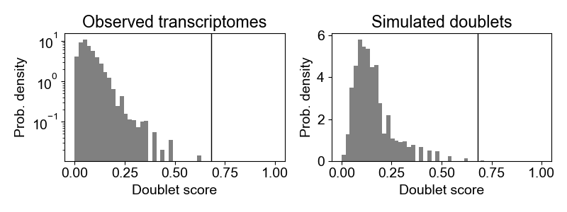
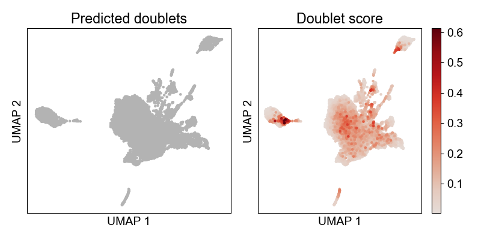

# Srublet for scRNA-seq doublet removing

Here is Srublet Github page: [Srublet Github](https://github.com/swolock/scrublet)

To identify doublets from scRNA-seq data set, I followed the python pipeline posted on Srublet Github and did a few modifications. 

- Filtered matrix from cellranger output was used as Srublet input.
- Run python scripts from termnial.
- Srublet output includes: on-screen printing results as mentioned in Srublet paper, two figures and two tables (one for doublet score, one binary file telling if a cell is doublet or not).

**Codes:**
```
python
import scrublet as scr
import scipy.io
import matplotlib.pyplot as plt
import numpy as np
import os

plt.rcParams['font.family'] = 'sans-serif'
plt.rcParams['font.sans-serif'] = 'Arial'
plt.rc('font', size=14)
plt.rcParams['pdf.fonttype'] = 42

# used callranger output filtered matrix and features as input
input_dir = '/Users/tingtingzhao/Documents/BWH/Projects/Hassan/src/Seurat_102521/HUB_hassan2021_scRNA-seq'
counts_matrix = scipy.io.mmread(input_dir + '/matrix.mtx.gz').T.tocsc()

# unzip features.tsv.gz
genes = np.array(scr.load_genes(input_dir + '/features.tsv', delimiter='\t', column=1))

print('Counts matrix shape: {} rows, {} columns'.format(counts_matrix.shape[0], counts_matrix.shape[1]))
print('Number of genes in gene list: {}'.format(len(genes)))

scrub = scr.Scrublet(counts_matrix, expected_doublet_rate=0.06)

doublet_scores, predicted_doublets = scrub.scrub_doublets(min_counts=2,
                                                          min_cells=3,
                                                          min_gene_variability_pctl=85,
                                                          n_prin_comps=30)

scrub.plot_histogram();
plt.savefig("DoubletScore.vs.ProbDensity.png")

print('Running UMAP...')
scrub.set_embedding('UMAP', scr.get_umap(scrub.manifold_obs_, 10, min_dist=0.3))
print('Done.')

scrub.plot_embedding('UMAP', order_points=True);
plt.savefig("DoubletScoreUMAP.png")

# export doublet score and logic files
np.savetxt("srublet.score", doublet_scores)
np.savetxt("srublet.logic", predicted_doublets)
```
**Intepretation of the Srublet results**
The output described in Srublet paper includes:
- A predicted ‘‘detectable doublet fraction’’. This is the predicted fraction of doublets that are neotypic.
- A ‘‘doublet score’’ for each observed transcriptome. This score is used for doublet classification, and it can also be interpreted as a posterior likelihood of a cell being a doublet when the fraction of doublets in the entire dataset is known.
- A standard error on the doublet score. This error allows establishing confidence in the assignment of cells as doublets.
- A binary label for each cell identifying neotypic doublets.

The output prited on screen while running Srublet:

Preprocessing...
Simulating doublets...
Embedding transcriptomes using PCA...
Calculating doublet scores...
Automatically set threshold at doublet score = 0.68
Detected doublet rate = 0.0%
Estimated detectable doublet fraction = 0.1%
Overall doublet rate:
Expected   = 6.0%
Estimated  = 0.0%
Elapsed time: 8.8 seconds


The two output figures are:




