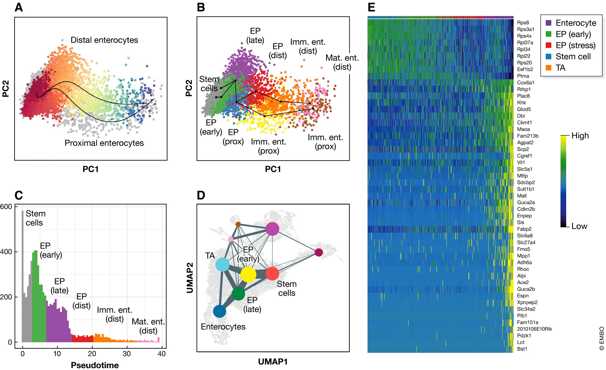
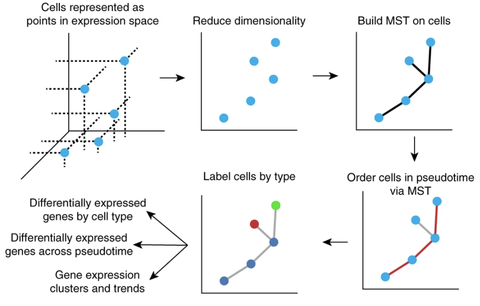
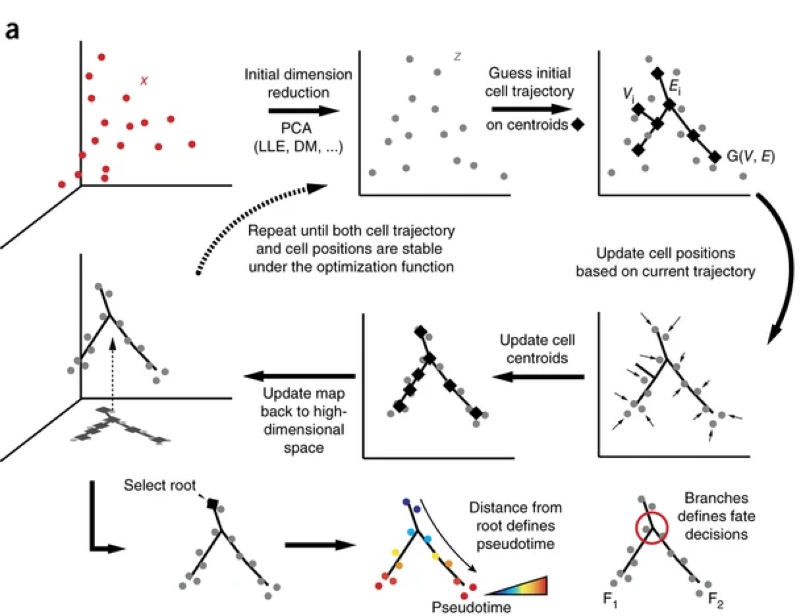

# Monocle 3 for trajectory analysis on scRNA-seq data

## What is trajectory inference?
Trajectory inference methods interpret single-cell data as a snapshot of a continuous process. This process is reconstructed by finding paths through cellular space that minimize transcriptional changes between neighbouring cells. The ordering of cells along these paths is described by a pseudotime variable. While this variable is related to transcriptional distances from a root cell, it is often interpreted as a proxy for developmental time. [Current best practices in single-cell RNA-seq analysis: a tutorial](https://www.ncbi.nlm.nih.gov/pmc/articles/PMC6582955/pdf/MSB-15-e8746.pdf)

  

Figure 7. Trajectory analysis and graph abstraction of mouse intestinal epithelium data from Haber et al (2017).
(A) Distal and proximal enterocyte differentiation trajectories inferred by Slingshot. The Distal lineage is shown coloured by pseudotime from red to blue. Other cells in the dataset are grey. (B) Slingshot trajectories over clusters in PCA space. Clusters are abbreviated as follows: EP—enterocyte progenitors; Imm. Ent.—immature enterocytes; Mat. Ent.—mature enterocytes; Prox.—proximal; Dist.—distal. (C) Density over pseudotime for the distal enterocyte trajectory from Fig 7A. Colours represent the dominant cluster labels in each pseudotime bin. (D) Abstracted graph representation of the dataset projected onto a UMAP representation. Clusters are shown as coloured nodes. Clusters that appear in other trajectories are labelled for comparison. “TA” denotes transit amplifying cells. (E) Gene expression dynamics over pseudotime in a general enterocyte trajectory using the “GAM” R library.

## Comparision of trajectory methods
[A comparison of single-cell trajectory inference methods.](https://www-nature-com.ezp-prod1.hul.harvard.edu/articles/s41587-019-0071-9.pdf)
- Overall, we found a large diversity across the four evaluation criteria, with only a few methods, such as PAGA, Slingshot and SCORPIUS, performing well across the board.

[Current best practices in single-cell RNA-seq analysis: a tutorial](https://www.ncbi.nlm.nih.gov/pmc/articles/PMC6582955/pdf/MSB-15-e8746.pdf)
- The comparison revealed that Slingshot (Street et al, 2018) outperformed other methods for simple trajectories that range from linear to bi- and multifurcating models. 
- If more complex trajectories are expected, PAGA (Wolf et al, 2019) was recommended by the authors. 
- Generally, any inferred trajectory should be confirmed with an alternative method to avoid method bias.

## What does Monocle do?
Monocle orders single-cell expression profiles in ‘pseudotime’—a quantitative measure of progress through a biological process. (Monocle 3 orders cells by their progress through differentiation rather than by the time they were collected.)

## Monocle papers

- The concept of pseudotime ordering for single-cell analysis (**pseudotemporal ordering**): [Monocle](http://cole-trapnell-lab.github.io/pdfs/papers/trapnell-cacchiarelli-monocle.pdf)
- The  use of **Reversed Graph Embedding** for single-cell analysis: [Monocle 2](http://cole-trapnell-lab.github.io/pdfs/papers/qiu-monocle2.pdf)
- The single-cell transcriptional landscape of mammalian organogenesis: [Monocle 3](https://cole-trapnell-lab.github.io/pdfs/papers/cao-spielmann-mouse-emb.pdf)

## Trajectory and subtrajectories 
As cells progress along a differentiation trajectory, they may diverge along two or more separate paths. After Monocle finds the longest sequence of similar cells, it examines cells not along this path to find alternative trajectories through the MST. It orders these subtrajectories and connects them to the main trajectory, and annotates each cell with both a trajectory and a pseudotime value. Monocle thus orders cells by progress through differentiation and can reconstruct branched biological processes, which might arise when a precursor cell makes cell fate decisions that govern the generation of multiple subsequent lineages. Importantly, Monocle is unsupervised and needs no prior knowledge of specific genes that distinguish cell fates, and is thus suitable for studying a wide array of dynamic biological processes.

## What is pseudotime? 

[pseudotime](http://cole-trapnell-lab.github.io/monocle-release/docs/#constructing-single-cell-trajectories)

- Pseudotime is a measure of how much progress an individual cell has made through a process such as cell differentiation. In many biological processes, cells do not progress in perfect synchrony. In single-cell expression studies of processes such as cell differentiation, captured cells might be widely distributed in terms of progress. That is, in a population of cells captured at exactly the same time, some cells might be far along, while others might not yet even have begun the process. This asynchrony creates major problems when you want to understand the sequence of regulatory changes that occur as cells transition from one state to the next. Tracking the expression across cells captured at the same time produces a very compressed sense of a gene's kinetics, and the apparent variability of that gene's expression will be very high. By ordering each cell according to its progress along a learned trajectory, Monocle alleviates the problems that arise due to asynchrony. 
- Instead of tracking changes in **expression** as a function of time, Monocle tracks changes as a function of **progress** along the trajectory, which we term ''pseudotime''. 
- Pseudotime is an abstract unit of progress: it's simply the distance between a cell and the start of the trajectory, measured along the shortest path. 
- The trajectory's total length is defined in terms of the total amount of transcriptional change that a cell undergoes as it moves from the starting state to the end state.

## The ordering workflow of Monocle
- Step 1: choosing genes that define progress
- Step 2: reducing the dimensionality of the data
- Step 3: ordering the cells in pseudotime

With the expression data projected into a lower dimensional space, Monocle is ready to learn the trajectory that describes how cells transition from one state into another. Monocle assumes that the trajectory has a tree structure, with one end of it the "root", and the others the "leaves". Monocle's job is to fit the best tree it can to the data. This task is called manifold learning A cell at the beginning of the biological process starts at the root and progresses along the trunk until it reaches the first branch, if there is one. That cell must then choose a path, and moves further and further along the tree until it reaches a leaf. **A cell's pseudotime value is the distance it would have to travel to get back to the root.**

## Algorithm of Monocle
- **First**, the algorithm represents the expression profile of each cell as a point in a high-dimensional Euclidean space, with one dimension for each gene. 
- **Second**, it reduces the dimensionality of this space using independent component analysis17. Dimensionality reduction transforms the cell data from a high-dimensional space into a low-dimensional one that preserves essential relationships between cell populations but is much easier to visualize and interpret18. 
- **Third**, Monocle constructs a minimum spanning tree (MST) on the cells, a previously developed approach now commonly used in other single- cell settings, such as flow or mass cytometry1,13. 
- **Fourth**, the algorithm finds the longest path through the MST, corresponding to the long- est sequence of transcriptionally similar cells. 
- **Finally**, Monocle uses this sequence to produce a ‘trajectory’ of an individual cell’s progress through differentiation.

  

## Algorithm of Monocle 2

  

(a) Monocle 2 automatically learns single-cell trajectories and branch points by reversed graph embedding (Online Methods). Each cell is represented as a point in high-dimensional space (x), where each dimension corresponds to the expression level of an ordering gene. Data are projected onto a lower-dimensional space (z) by dimension-reduction methods such as PCA, and Monocle 2 constructs a spanning tree on a set of centroids (diamonds) chosen automatically using k-means clustering. Cells are then shifted toward the nearest tree vertex, vertex positions are updated to ‘fit’ cells, a new spanning tree is learned, and the process is iterated until the tree and cells converge. The user then selects a tip as the ‘root’, each cell’s pseudotime is calculated as its geodesic distance along the tree to the root, and its branch
is automatically assigned based on the principal graph. 

## Algorithm of Monocle 3
Monocle 3 first projects cells onto a low-dimensional space encoding transcriptional state using UMAP. It then groups mutually similar cells using the Louvain community detection algorithm, and merges adjacent groups into ‘supergroups’. Finally, it resolves the paths or trajectories that individual cells can take during development, identifying the locations of branches and convergences within each supergroup.

## Minimum spanning tree (MST)
A minimum spanning tree (MST) or minimum weight spanning tree is a subset of the edges of a connected, edge-weighted undirected graph that connects all the vertices together, without any cycles and with the minimum possible total edge weight. That is, it is a spanning tree whose sum of edge weights is as small as possible. More generally, any edge-weighted undirected graph (not necessarily connected) has a minimum spanning forest, which is a union of the minimum spanning trees for its connected components.

There are many use cases for minimum spanning trees. One example is a telecommunications company trying to lay cable in a new neighborhood. If it is constrained to bury the cable only along certain paths (e.g. roads), then there would be a graph containing the points (e.g. houses) connected by those paths. Some of the paths might be more expensive, because they are longer, or require the cable to be buried deeper; these paths would be represented by edges with larger weights. Currency is an acceptable unit for edge weight – there is no requirement for edge lengths to obey normal rules of geometry such as the triangle inequality. A spanning tree for that graph would be a subset of those paths that has no cycles but still connects every house; there might be several spanning trees possible. A minimum spanning tree would be one with the lowest total cost, representing the least expensive path for laying the cable.
