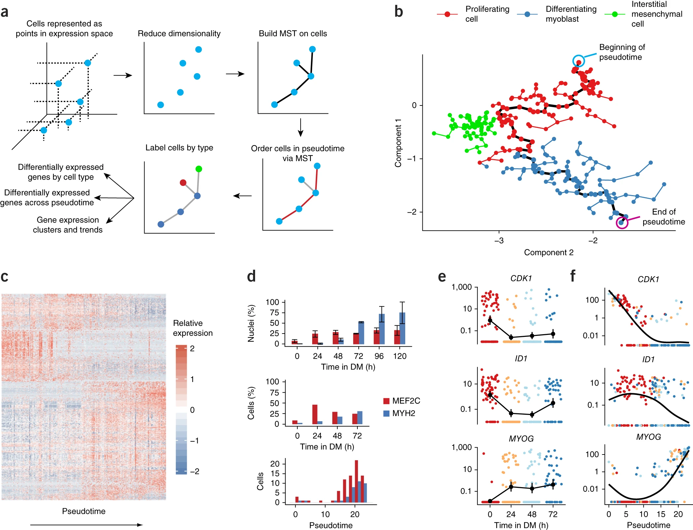

# Monocle 3 for trajectory analysis on scRNA-seq data

## What is trajectory inference?
Trajectory inference methods interpret single-cell data as a snapshot of a continuous process. This process is reconstructed by finding paths through cellular space that minimize transcriptional changes between neighbouring cells. The ordering of cells along these paths is described by a pseudotime variable. While this variable is related to transcriptional distances from a root cell, it is often inter- preted as a proxy for developmental time. [Current best practices in single-cell RNA-seq analysis: a tutorial](https://www.ncbi.nlm.nih.gov/pmc/articles/PMC6582955/pdf/MSB-15-e8746.pdf)

  

## What does Monocle do?
Monocle orders single-cell expression profiles in ‘pseudotime’—a quantitative measure of progress through a biological process.

Monocle 3 orders cells by their progress through differentiation rather than by the time they were collected.

## Monocle related papers

The concept of pseudotime ordering for single-cell analysis: [Monocle pseudotime](http://cole-trapnell-lab.github.io/pdfs/papers/trapnell-cacchiarelli-monocle.pdf)

The  use of Reversed Graph Embedding for single-cell analysis: [Monocle 2](http://cole-trapnell-lab.github.io/pdfs/papers/qiu-monocle2.pdf)

The single-cell transcriptional landscape of mammalian organogenesis: [Monocle 3](https://cole-trapnell-lab.github.io/pdfs/papers/cao-spielmann-mouse-emb.pdf)

## Algorithm of Monocle 3
- First the algorithm represents the expression profile of each cell as a point in a high-dimensional Euclidean space, with one dimension for each gene. 
- Second, it reduces the dimensionality of this space using independent component analysis17. Dimensionality reduction transforms the cell data from a high-dimensional space into a low-dimensional one that preserves essential relationships between cell populations but is much easier to visualize and interpret18. 
- Third, Monocle constructs a minimum spanning tree (MST) on the cells, a previously developed approach now commonly used in other single- cell settings, such as flow or mass cytometry1,13. 
- Fourth, the algorithm finds the longest path through the MST, corresponding to the long- est sequence of transcriptionally similar cells. 
- Finally, Monocle uses this sequence to produce a ‘trajectory’ of an individual cell’s progress through differentiation.

  

## Minimum spanning tree (MST)
A minimum spanning tree (MST) or minimum weight spanning tree is a subset of the edges of a connected, edge-weighted undirected graph that connects all the vertices together, without any cycles and with the minimum possible total edge weight. That is, it is a spanning tree whose sum of edge weights is as small as possible. More generally, any edge-weighted undirected graph (not necessarily connected) has a minimum spanning forest, which is a union of the minimum spanning trees for its connected components.

There are many use cases for minimum spanning trees. One example is a telecommunications company trying to lay cable in a new neighborhood. If it is constrained to bury the cable only along certain paths (e.g. roads), then there would be a graph containing the points (e.g. houses) connected by those paths. Some of the paths might be more expensive, because they are longer, or require the cable to be buried deeper; these paths would be represented by edges with larger weights. Currency is an acceptable unit for edge weight – there is no requirement for edge lengths to obey normal rules of geometry such as the triangle inequality. A spanning tree for that graph would be a subset of those paths that has no cycles but still connects every house; there might be several spanning trees possible. A minimum spanning tree would be one with the lowest total cost, representing the least expensive path for laying the cable.

## Trajectory and subtrajectories 
As cells progress along a differentiation trajectory, they may diverge along two or more separate paths. After Monocle finds the longest sequence of similar cells, it examines cells not along this path to find alternative trajectories through the MST. It orders these subtrajectories and connects them to the main trajectory, and annotates each cell with both a trajectory and a pseudotime value. Monocle thus orders cells by progress through differentiation and can reconstruct branched biological processes, which might arise when a precursor cell makes cell fate decisions that govern the generation of multiple subsequent lineages. Importantly, Monocle is unsuper- vised and needs no prior knowledge of specific genes that distinguish cell fates, and is thus suitable for studying a wide array of dynamic biological processes.
